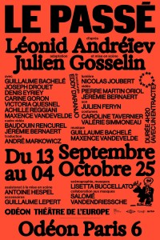
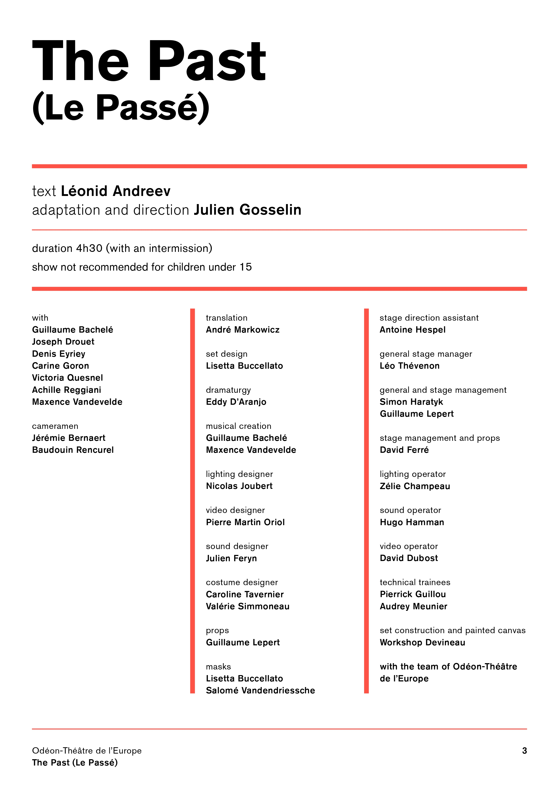
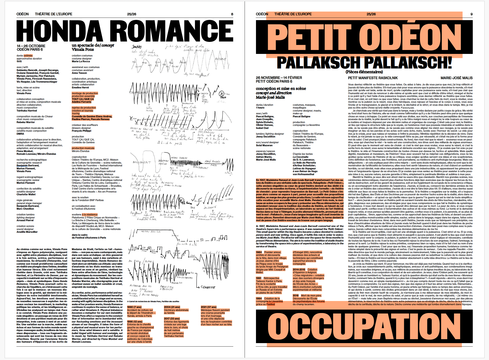
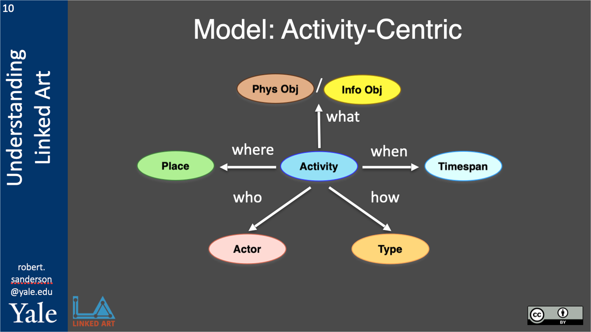

# Vers un modèle de l'événement théâtral

## 1. Introduction

Ce qui suit est une discussion sur une tentative de modélisation du « théâtre » comme « événement » à partir des informations d’un objet textuel, nativement numérique : le programme de saison 2025-2026 du Théâtre de l’Odéon à Paris. Cette discussion suit les trois étapes de la division proposée par Meunier entre le *modèle conceptuel*, le *modèle formel* et le *modèle matériel*.[^1] Le modèle conceptuel est issu de plusieurs mois de discussions au sein de l’équipe du projet STAGE.[^2] Le modèle formel est actuellement en cours de développement en collaboration avec la communauté [Linked Art](https://linked.art/). Linked Art a publié la *version 1.0* d’une structure ontologique visant à représenter des objets et des événements muséaux, sur la base de l’ontologie du [CIDOC Conceptual Reference Model](https://cidoc-crm.org) (CIDOC-CRM). Le schéma de Linked Art propose un ensemble d’entités, comme des personnes, des objets ou des organismes, interconnectées par des relations prédéfinies, comme *influenced_by*, *produced_by* ou *carried_out_by*. La [collaboration](https://github.com/stage-to-data/linked-art-pa) entre STAGE et Linked Art vise à étendre cette ontologie afin qu’elle couvre également les arts de la scène.

Dans le présent exercice, les modèles conceptuel et formel sont implémentés dans un exercice pratique qui porte sur le Théâtre de l’Odéon, dans le cadre du séminaire FRA-6730 à l’UdeM. Cet exercice vise à mieux comprendre le potentiel, les limites et les faiblesses de la version actuelle du modèle que nous développons dans le cadre de STAGE et de ma thèse. L’objectif est de mettre en lumière les renégociations constantes entre aspirations théoriques et réalisme pratique qui caractérisent la conception d’un tel modèle, mais aussi de préciser des améliorations à apporter.

[^1]: Jean-Guy Meunier, « Humanités numériques ou computationnelles : enjeux herméneutiques », *Sens Public* (décembre 2014).
[^2]: Clarisse Bardiot, Bernard Jacquemin, Antonios Lagarias, Jeanne Fras et Jacob Hart, « From Archives to Networks: Data Modeling for Mapping Performance History at the Festival d’Avignon », communication présentée à *IFTR 2025*, Cologne, juin 2025.

## 2. Quelques enjeux théoriques

### Représentations et reconstructions d’un objet fugace

Évoquer le caractère éphémère et toujours changeant du théâtre est désormais une entrée quasi classique de toute étude consacrée à l’histoire des événements théâtraux. Affirmer que le théâtre est éphémère revient à reconnaître qu’un événement des arts de la scène, c’est-à-dire un spectacle, n’existe que dans un temps et un lieu spécifiques, un *ici-et-maintenant* singulièrement créé par les conditions propres à une soirée donnée et donc, par définition, impossible à reproduire. Chercheurs et spectateurs à la fois reconnaissent que le fait qu’une représentation théâtrale « marche bien » ou « se ressente » d’une certaine manière tient à l’atmosphère unique de ce soir-là, co-produite par une multitude d’éléments largement soumis au hasard, comme l’énergie des acteurs, la réaction du public, la réactivité des équipes techniques, voire l’efficacité du système de chauffage du théâtre.[^3]

Autrement dit, même lorsque le titre du spectacle et la distribution artistique sont identiques, un événement différent a lieu chaque soir. Lorsque les opinions de deux spectateurs ayant assisté au même spectacle à des dates différentes divergent, le consensus est souvent trouvé en admettant que leur désaccord peut provenir du fait qu’ils parlent, à tous les sens du terme, de deux *choses différentes*. Des visions d’un théâtre « mécanisé », composé d’acteurs-automates et dans lequel chaque représentation serait une copie (presque) exacte de la précédente, ont certes été évoquées dans l’histoire des arts de la scène, sans toutefois voir le jour.[^4] Dès lors, il est possible de constater que l’objet des études théâtrales ne se laisse pas définir de manière univoque, mais se situe quelque part *entre* ses différentes *représentations* singulières.

Pourtant, dans le langage courrant, on parle souvent de l’événement théâtral en tant que la « copie » d’un objet virtuel existant dans l’« esprit » de l’auteur du texte, ou du metteur en scène. En revanche, de nombreuses études s'intéresse davantage sur le théâtre comme pratique collaborative, dans laquelle l’objet artistique est le produit de renégociations pratiques et théoriques constantes au sein de l’équipe créative et administrative, depuis les révisions du texte jusqu’à la répétition générale. S’il est  difficile de discuter de l’existence d’un *texte* « virtuel et idéal », détaché de son support matériel,[^5] il l’est plus encore de penser « l’idée » d’un spectacle indépendamment des processus matériels qui la manifestent littéralement, et différemment, chaque soir. Si la représentation théâtrale peut relever de la catégorie du « texte sémiologique infini » donc, au sens proposé par Archibald, ce n’est qu’à la condition que les études théâtrales s’attachent à disséquer les conditions de sa création et de sa réception, autrement dit la manière dont le théâtre constitue une « œuvre culturelle » liée à la « base matérielle de la société », qui conditionne son émergence à partir de processus à la fois socio-historiques et créatifs.[^6]

Les historiens du théâtre peuvent, cependant, avoir des difficultés à accéder à leur objet d’étude. Le théâtre, entendu dans sa définition la plus basique, comme une assemblée d’artistes sur une scène face à un public, est accessible pendant la représentation, avec les limites déjà évoquées, mais devient inaccessible dès qu’elle s’achève. Aucun support matériel ne peut prétendre représenter de manière exhaustive ne serait-ce qu’une de ses multiples représentations. Les photographies ou les captations vidéo transforment l’expérience théâtrale, de la même manière qu’un enregistrement audio transforme l’expérience du concert vivant.[^7] Ce qui reste à l’issue d’un événement théâtral est, d’une part, la mémoire partielle et subjective des personnes présentes ce soir-là et, d’autre part, un ensemble de traces matérielles : des photographies, le programme, des critiques de presse ou des entretiens. Les chercheurs ont aussi souvent accès à des informations sur la production, comme les choix scénographiques, les costumes, la musique, les modifications apportées au texte par rapport à la version originale ou, parfois, les ambitions artistiques du metteur en scène. Ces éléments constituent, en un certain sens, les données les plus « objectives » sur l’événement théâtral, dans la mesure où elles sont moins affectées par les différences entre chaque soirée de représentation. Les historiens se trouvent ainsi contraints de produire un récit scientifique entre histoire et mémoire, au risque d’une « mythification » ou d’une « mystification ».[^8] L’objet des études théâtrales est donc reconstruit à partir de ses fragments.

Ceux-ci peuvent prendre la forme d’archives officielles, de publications de presse, de rumeurs, d’anecdotes ou d’observations personnelles. Les historiens consacrent ainsi une part importante de leur travail à de véritables « chasses » aux archives, visant à retrouver des documents égarés ou négligés susceptibles de révéler des aspects méconnus d’un spectacle. La disponibilité de telles traces historiques est donc la condition première qui permet l’écriture d’un récit. Il est, par exemple, relativement facile d’écrire sur les spectacles de Romeo Castellucci au Festival d’Avignon. Les intentions de l’artiste, les modalités de production et la réception par le public sont largement documentées, Castellucci étant l’un des metteurs en scène « légendaires » ayant marqué l’histoire de l’institution. En revanche, dès lors que l’on s’intéresse à des moments moins « légendaires » du festival, les sources disponibles se révèlent beaucoup plus limitées.

On en arrive alors à deux questions. La première concerne les modalités d’accès aux informations relatives aux spectacles bénéficiant d’une moindre couverture médiatique. Doivent-ils être ignorés et progressivement relégués dans l’oubli des récits historiques, ou constituent-ils au contraire une composante essentielle de l’évolution des pratiques théâtrales, même lorsqu’ils sont faiblement documentés ? La seconde porte sur les types de problématiques que nous sommes obligés d’ignorer, non pas en raison d’un manque de traces historiques, mais, à l’inverse, en raison de leur abondance. Par exemple, chaque année, le Festival Off d’Avignon produit des documents contenant des informations sur plus de 1500 spectacles. Ces traces sont-elles utiles pour les historiens ou risquent-elles de se perdre dans le flux informationnel, au point de devenir inexploitables ?


[^3]: Jean-Marc Larrue, « Lieu et théorie des atmosphères », communication présentée au séminaire d’été du CRILCQ, *Voir avec les lieux*, juillet 2025, Avignon.

[^4]: Voir par exemple le concept de « sur-marionnette » (Über-Marionette) proposé par Edward Gordon Craig en 1908, notion cryptique et floue, qui demeure aujourd’hui encore un objet d’étude. Certains y voient une marionnette automatisée à taille humaine, destinée à remplacer les acteurs sur scène. La parfaite reproductibilité de ses gestes permettrait un contrôle total de la représentation et offrirait au théâtre la possibilité de se soustraire aux fluctuations physiques et émotionnelles de l’interprète humain. Voir Patrick Le Bœuf, « On the Nature of Edward Gordon Craig’s Über-Marionette », *New Theatre Quarterly*, vol. 26, no 2, 2010, p. 102-114.

[^5]: Samuel Archibald, *Le texte et la technique* (Montréal : Le Quartanier, 2009), p. 21.

[^6]: Ibid., p. 19

[^7]: John Cage, par exemple, s’opposait à l’idée de machines capables de reproduire des enregistrements audio, allant jusqu’à affirmer que « ce serait un acte de charité, y compris envers soi-même, de les briser (les disques commerciaux) chaque fois qu’on en découvre ». Dans le même temps, Cage se montrait très favorable à l’utilisation de machines pour générer du son. Branden W. Joseph, « The Play of Repetition: Andy Warhol’s *Sleep* », *Grey Room*, no 19, 2005, p. 22-53, ici p. 40.

[^8]: Bardiot, Clarisse. *Performing Arts and Digital Humanities: From Traces to Data*. London: ISTE Ltd & John Wiley & Sons, Inc., 2021, 4.

### Le modèle qui ne pouvait pas tout modéliser

Au cours des deux dernières décennies, les institutions patrimoniales ont numérisé une large part de leurs fonds d’archives des arts de la scène. Les processus de numérisation visaient à produire des « doublons » numériques des documents originaux, allant parfois jusqu’à la destruction de ces derniers à l’issue de l’opération.[^9] Cette logique de duplication a permis aux chercheurs de decouvrire et d’accéder à un grand nombre de documents, y compris à distance, et d’en assurer la préservation, sans pour autant permettre un mode de « lecture » fondamentalement différent.[^10] Le chercheur étudie ainsi un document numérisé avec une attention comparable à celle qu’il accorde au document imprimé. Le plaisir matériel du toucher et de l’odeur du papier se trouve remplacé par le potentiel des métadonnées du document numérique, un potentiel qui reste toutefois souvent limité à quelques mots-clés et entités nommées. Aujourd’hui, la recherche en humanités numériques tend donc à s’éloigner d’une conception du numérique centrée sur la numérisation des objets imprimés, pour aller vers un numérique qui se construit à partir de structures de données permettant une lecture plus globale du théâtre en tant qu’événement.

Le Groupe de recherches théâtrales et musicologiques du CNRS a été créé en 1965 avec pour ambition d’étudier le « théâtre dans toutes ses dimensions ».[^15] Ici, le mot « toutes » marque un déplacement par rapport à une approche centrée sur le texte dramatique, longtemps, et encore souvent, mobilisé comme « proxy » pour l’étude du théâtre, mais cette ambition reste toutefois obscure. Prenons l’exemple de *La Tempête* de Peter Brook. Le spectacle a été créé au Festival d’Avignon en 1991, puis repris dans d’autres théâtres, festivals et pays, parfois avec des distributions différentes et dans d’autres langues. Brook avait déjà monté une version de *The Tempest* dans les années 1960 sous le titre *The Tempest Project*, et cette production a continué d’être jouée après sa mort, ses acteurs poursuivant la présentation de cette même (?) mise en scène à Paris. Parler de « toutes » les dimensions de *La Tempête* de Peter Brook revient dès lors à rendre compte, de manière aussi détaillée que possible, des trajectoires historiques, matérielles et esthétiques de l’objet étudié : ce que nous en savons, mais aussi ce que nous ne pouvons pas en savoir. Un modèle de l’événement théâtral doit ainsi maintenir cette relation complexe entre une production donnée, les représentations singulières qui en résultent et l'objet *conceptuel* que désigne *La Tempête* de Peter Brook, en admettant que ce dernier relève largement d’une construction discursive. Une telle modélisation tenterait donc de créer une structure à partir de réalités jugées trop chaotiques, qu’il s’agisse de phénomènes culturels, historiques ou politiques, afin de mieux les comprendre[^11]. Comme l’a noté Michael Sperberg-McQueen, « la modélisation est une manière de rendre explicites nos présupposés quant à la nature d’un texte ou d’un artefact »[^14] et, en ce sens, les débats méthodologiques deviennent des débats sur les modèles, autrement dit sur la manière dont nous organisons et gérons nos savoirs.


[^9]: Clarisse Bardiot, *Performing Arts and Digital Humanities: From Traces to Data*. London: ISTE Ltd & John Wiley & Sons, Inc., 2021, p. xxxvi.

[^10]: Franco Moretti oppose le *close reading*, l’étude attentive et approfondie d’un petit nombre de documents, au *distant reading*, qui vise à étudier de grandes tendances à partir de l’analyse de milliers de documents. Voir Franco Moretti, « Conjectures on World Literature », *New Left Review*, no 1, janvier–février 2000, p. 54-68.

[^11]: Julia Flanders et Fotis Jannidis, *The Shape of Data in the Digital Humanities: Modeling Texts and Text-based Resources*, dir. (Abingdon, Oxford & New York: Routledge, 2019), pp. 3-7.

[^12]: Ibid.
 
[^13]: Ibid., p. 4. 

[^14]: Ibid., p. 3.
[^15]: Clarisse Bardiot, Performing Arts and Digital Humanities: From Traces to Data. London: ISTE Ltd & John Wiley & Sons, Inc., 2021, p. 3.

## 3. Le modèle conceptuel : l'idée, la production et la répresentation

Le modèle conceptuel de l’événement théâtral proposé dans cet exercice de modélisation s’articule donc autour de trois niveaux (voir [figure 3.1](#figure-3.1)).

En son centre se trouve une production spécifique (niveau B), conçue comme une *activity* selon l’ontologie Linked Art et le CIDOC-CRM. L’objet B représente la production d’une pièce dans un lieu donné, au sein d’une saison théâtrale ou d’un festival, par exemple, la mise en scène de *The Tempest* de William Shakespeare par Peter Brook au Festival d’Avignon en 1991. Cette production est reliée à un *objet conceptuel* (niveau A), qui représente l’« idée » qu’un metteur en scène se fait d’une œuvre donnée avant sa matérialisation au sein d’une production spécifique. L’objet A représente donc l’« idée » d’une mise en scène et est ainsi propre à un metteur en scène et à un temps. Il peut être associé à plusieurs objets B, dans la mesure où le « même » spectacle peut être programmé dans différents lieux, et il peut aussi être relié à des entités externes qui l’ont influencé ou inspiré, comme un auteur, un texte dramatique ou un autre objet conceptuel de mise en scène. Enfin, chaque production B est rattachée à un ensemble de représentations (niveau C), qui contiennent des informations propres à chaque date, comme les variations de distribution. Ce schéma à trois niveaux vise ainsi à distinguer une production de ses différentes représentations (relation entre B et C), tout en permettant de regrouper plusieurs productions dérivant d’une entité « unique », au moins au niveau conceptuel (relation entre A et B). Il faut également noter que la logique d’objets conceptuels se manifestant à travers des incarnations matérielles, vision simpliste dans son caractère unidirectionnel mais facile à implémenter, constitue l’une des bases structurelles du CIDOC-CRM.


<a id="figure-3.1"></a>
<p align="center">
  
</p>

*Figure 3.1 : Le modèle conceptuel proposé dans le cadre de STAGE, en collaboration avec la communauté Linked Art.*

Pour passer du modèle conceptuel au modèle pratique dans le cas du programme de saison de l’Odéon, on doit donc générer un objet B pour chaque spectacle. Ensuite, on peut inférer plusieurs objets C, chacun correspondant à une représentation distincte, ainsi qu’un objet A unique pour chaque spectacle, qui renvoie à son « idée » (voir [figure 3.2](#figure-3.2)).

Un problème posé par cette conception de l’événement théâtral est qu’elle n’évite pas l’attribution implicite d’un spectacle à un seul artiste ou à un seul groupe, au risque d’ignorer sa dimension collaborative. Certes, il est possible de documenter et d’avoir une vision de l’ensemble des personnes et des institutions ayant participé à la production du spectacle et à chaque représentation, mais le schéma conceptuel est néanmoins ordinal, où chaque production est la matérialisation d’une vision *préexistante* : celle du metteur en scène. Cette hiérarchie risque ainsi de reproduire une logique d’*auteurisme*. Cependant, en termes pratiques, la possibilité de documenter l’ensemble des collaborateurs au sein des multiples objets B permet de conserver une trace relativement « complète » de la nature collaborative du processus théâtral et ouvre la voie à des analyses sur l’évolution et les transformations de cette « idée » initiale.


<a id="figure-3.2"></a>
| objet conceptuel (A)                                   | productions (B)               | représentations (C)                     |
|-------------------------------------------------------|-------------------------------|-----------------------------------------|
| *Le Passé*, conçu par Julien Gosselin                    | au Théâtre de l’Odéon          | un événement par date              |
| *Musée Duras*, conçu par Julien Gosselin                 | au Théâtre de l’Odéon          | un événement par date              |
| *Honda Romance*, conçu par Vimala Pons                   | au Théâtre de l’Odéon          | un événement par date              |
| *Pallaksch Pallaksch !*, conçu par Marie-José Malis      | au Théâtre de l’Odéon          | un événement par date              |

*Figure 3.2 : Le modèle conceptuel appliqué pour décrire le programme de saison du Théâtre de l’Odéon, limité à quatre spectacles. Chaque événement théâtral consiste en un objet conceptuel, une série des objects-production (ici uniquement au Théâtre de l’Odéon) et un objet-représentation (C) pour chaque date individuelle.*


## 4. Modèle pratique (I)
### La saison théâtrale comme tableau Excel

Comme évoqué plus haut, l’événement théâtral est largement dominé par des histoires orales, un « flux de mots » intelligible pour un lecteur humain mais qui, pour être traité par un ordinateur, doit être structuré.[^16] Cette structure peut ensuite être communiquée à une machine afin de permettre des analyses computationnelles. Si l’objectif est de modéliser l’événement théâtral, le point de départ ne peut être qu’une source matérielle portant d’informations sur cet événement. Le choix le plus évident est un programme. Distribués à l’entrée du théâtre, les programmes ont d’abord un statut informatif : ils fournissent aux spectateurs des éléments sur les artistes et les institutions impliqués dans le spectacle. Une fois la représentation achevée, ils deviennent une trace matérielle, un marqueur spatio-temporel attestant qu’un événement réunissant artistes, techniciens, spectateurs, institutions culturelles et producteurs a bien eu lieu. La plupart des lecteurs peuvent, d’un simple coup d’œil, comprendre les rôles et les relations entre les personnes et les institutions mentionnées dans un programme. Le modèle proposé ici cherche à reproduire cette lecture en formalisant les informations contenues dans le programme à travers un ensemble d’entités et de relations.

Le [programme de saison](../assets/pdf/programme-saison-odeon.pdf) du Théâtre de l’Odéon à Paris est un dépliant de 32 pages, composé principalement d’éléments en noir et blanc. La couverture affiche le nom du théâtre, *Odéon Théâtre de l’Europe*, accompagné d’un court texte retraçant son histoire, des noms des artistes programmés, ainsi que d’éléments graphiques, plusieurs logos et un croquis du théâtre vu depuis le balcon. Le sommaire offre une vue d’ensemble des informations contenues dans le document. Une note d’intention du directeur, Julien Gosselin, ouvre le programme (pp. 2–3), suivie des descriptions de seize productions (pp. 4–23). Les politiques tarifaires et autres informations pratiques sont regroupées aux pages 24 à 27. Les dernières pages présentent des activités complémentaires, telles que des initiatives pédagogiques et culturelles, ainsi que des informations relatives à l’équipe du théâtre et à ses institutions partenaires. Le dépliant se termine par une publicité en pleine page pour *Hermès Paris*, entreprise de luxe dont le chiffre d’affaires est [estimé](https://www.zonebourse.com/cours/action/HERMES-INTERNATIONAL-4657/societe/) à environ 15 milliards d’euros en 2024.

Toutes ces informations ne sont toutefois pas pertinentes pour la modélisation d’un événement théâtral. Dans le cadre de cet exercice, nous nous concentrons exclusivement sur les pages décrivant quatre productions : *Le Passé* (pp. 4–5), *Musée Duras* (p. 7), *Honda Romance* (p. 8) et *Pallaksch pallaksch!* (p. 9). Cela dit, les informations ici ignorées pourraient néanmoins être utilisées, toujours dans le cadre de l’ontologie Linked Art. Des données pratiques telles que la disposition des salles, les politiques tarifaires ou les dispositifs d’accessibilité, de même que les informations relatives au personnel du théâtre et à ses partenaires, peuvent par exemple servir à la modélisation du Théâtre de l'Odéon, comme institution. De la même manière, le programme lui-même pourrait être modélisé comme un *objet linguistique*, incluant notamment des informations sur sa conception graphique ou sur son impression.

Enfin, les informations du programme de saison correspondent souvent à celles que l’on retrouve dans la feuille de salle, faite spécifiquement pour chaque spectacle (voir [figure 4.1](#figure-4.1)). Ces deux types de documents ne relèvent toutefois pas de la même temporalité. Le programme de saison annonce des représentations plusieurs mois avant leur date et ne peut donc pas rendre compte d’éventuelles modifications, telles que des changements de distribution, voire des annulations. À l’inverse, la feuille de salle est imprimée à une date proche de la première représentation, ce qui implique que les informations qu’elle contient sont généralement plus fidèles aux conditions effectives de la représentation. Le plus souvent, la feuille de salle constitue la preuve qu’un spectacle a bien eu lieu, tandis que le programme de saison reflète plutôt les intentions et la programmation prévisionnelle du théâtre.

<a id="figure-4.1"></a>
<p align="center">
  
  
  
</p>


*Figure 4.1 : Trois documents portant des informations similaires concernant <span style="font-style: normal;">Le Passé</span>, mis en scène par Julien Gosselin au Théâtre de l’Odéon : la feuille de salle, le dossier de presse et le programme de saison. Dans le cas du modèle proposé ici, tous peuvent être mobilisés pour extraire des informations relatives à la production.*


[^16]: Julia Flanders et Fotis Jannidis, *The Shape of Data in the Digital Humanities: Modeling Texts and Text-based Resources*, dir. (Abingdon, Oxford & New York: Routledge, 2019), p. 7.

### La structure implicite et explicite des programmes de théâtre

La première étape consiste donc à déterminer quelles informations contenues dans le programme sont pertinentes pour la modélisation de l’événement théâtral, ainsi que la manière dont ces informations doivent être « extraites ». L’extraction renvoie ici à un processus en deux temps. Il s’agit d’abord d’une opération de transcription : un texte libre au format PDF est transféré, manuellement, dans ce cas, dans un tableau Excel structuré. La structure de ce tableau correspond aux exigences du modèle conceptuel, et reflète l’interprétation humaine du document. Ainsi, une courte description du spectacle est labellisée comme *synopsis*, des dates figurant à proximité du titre sont enregistrées comme *start_date* et *end_date*, et le titre du spectacle devient un *title*.

Dans un second temps, l’extraction implique également une transformation. Le texte saisi dans le tableau doit être « normalisé » afin d'être traité et analysé. Ce processus suppose l’élimination d’éléments liés aux choix graphiques, comme la taille et le type de police, l’organisation spatiale des informations sur la page ou encore certaines ponctuations. Les paramètres précis de cette transformation sont définis par le chercheur. Dans le cas du programme de l’Odéon, ce traitement a été fait avec de [courtes fonctions](../scripts/utils.py) écrites en Python, comprenant par exemple la conversion des textes en minuscules, la suppression des espaces superflus, la transformation de la durée des spectacles en minutes, ainsi que la création de listes de personnes et d’institutions (voir le code [ici](../scripts/b-transform-raw-text.py)). L’extraction d’informations consiste ainsi en une transcription [« brute »](../data/excel/odeon-raw.xlsx) du texte original, suivie d’un « nettoyage »  qui donne lieu à un nouveau [fichier .xslx](../data/excel/clean-csv.xlsx).

Ce processus d’extraction soulève trois questions. La première est liée à la sélection. Certaines informations présentes dans le programme sont écartées en fonction des attentes du modèle. Or, ces informations participent, d’une certaine manière, à l’événement théâtral, dans la mesure où elles contribuent à l’expérience du spectateur. La [figure 4.2](#figure-4.2) présente, en orange, certains des éléments qui n’ont pas été intégrés dans la version actuelle du modèle. S’il est toujours possible d’enrichir le modèle en y ajoutant de nouvelles catégories, par exemple les biographies réelles ou fictionnelles associées à chaque metteur en scène dans les descriptions du Théâtre de l’Odéon, certaines informations seront néanmoins toujours exclues. À cet égard, le modèle ne peut prétendre rendre compte de l’ensemble des informations auxquelles un lecteur accède lorsqu’il consulte l’objet imprimé.

Deuxièmement, l’élimination des éléments de mise en page accroît encore la distance entre le modèle et le lecteur. Les conventions graphiques des programmes de théâtre permettent aux lecteurs de comprendre les informations qu’ils contiennent sans recourir à des labels explicites. Dans certains cas, l’information est clairement identifiée, par exemple par la mention « production » suivie du nom d’un collectif artistique, ou « mise en scène » suivie du nom d’un artiste. Très souvent, toutefois, la labellisation reste implicite. Lorsque le nom d’un personnage est séparé par un simple espace du nom du comédien, cet interstice porte une signification sémantique : il implique une relation de type « interprété par », qui n’a que rarement besoin d’être formulée. Les lecteurs comprennent intuitivement le sens latent de cet interstice. Cette articulation entre informations implicites et explicites est si familière que les graphistes jouent délibérément avec ces conventions afin de concevoir des programmes plus « originaux », des documents qui informent tout en surprenant le lecteur. Le modèle risque ainsi de restreindre ce jeu interprétative.


<a id="figure-4.2"></a>
<p align="center">
  
</p>

*Figure 4.2 : En orange, un exemple des informations qui n’ont pas été saisies dans le tableau Excel.*

Troisièmement, un choix doit être fait concernant les variations dans la structuration des équipes artistiques. Chaque production décrit les rôles assumés par ses membres selon sa propre logique. Prenons l’exemple de la *création vidéo*. Dans *Le Passé*, le rôle de *vidéo* est attribués à deux artistes, tandis que deux autres artistes chargés du *cadre vidéo* sont également mentionnés en tant que comédiens sur scène. Dans *Musée Duras*, en revanche, la création vidéo est répartie entre deux *régies vidéo* et un *collaborateur à la vidéo*. Faut-il conserver ces distinctions sémantiques ou les réduire à une catégorie unique, par exemple *vidéo* ? Les vocabulaires contrôlés sont conçus pour répondre à ce type de problème et proposent des catégories « normalisées » visant à représenter les activités créatives à un niveau relativement général. Le [vocabulaire des rôles de la BnF](https://data.bnf.fr/vocabulary/roles), par exemple, est aligné sur d’autres vocabulaires contrôlés, comme celui de la [Library of Congress](https://id.loc.gov/vocabulary/relators) (LoC), et comprend des termes-clés destinés à couvrir « toutes » les fonctions créatives. Cette normalisation permet d’imposer une structure unifiée aux variations propres à chaque production et de retrouver, par exemple, l’ensemble des artistes ayant participé à la tâche [vidéo](https://id.loc.gov/vocabulary/relators/vdg) de nombreuses productions différentes, au moyen d’un seul mot-clé. Toutefois, les vocabulaires contrôlés impliquent également une perte de précision sémantique. Parler d'un *collaborateur à la vidéo* plutôt de *régie vidéo* par exemple, renvoie à des pratiques professionnelles historiquement situées. La préservation des hiérarchies internes au sein des tâches créatives permet de reconstituer des généalogies de métiers, comme l’ont montré des études sur l’évolution professionnelle des équipes techniques à Hollywood.[^17] Si le maintien de plusieurs termes pour désigner les fonctions liées à la vidéo peut compliquer les requêtes de recherche, il conserve néanmoins une finesse sémantique qui donne lieu à de nouvelles pistes de recherche.

Dans le modèle proposé, nous cherchons à maintenir ces deux niveaux sémantiques. D’une part, nous nous appuyons sur le vocabulaire contrôlé de la LoC afin de diviser l’événement théâtral en un ensemble prédéfini de tâches créatives (par exemple *mise en scène*, *scénographie*, etc.). D’autre part, à l’intérieur de chacune de ces tâches, nous conservons la formulation originale du rôle attribué à chaque artiste, sous la forme d’un texte libre (voir les détails dans la partie 4 sur le [modèle formel](#ch_5)).

Suivant cette logique, nous obtenons un tableau Excel avec quatre lignes et 53 colonnes. Chaque colonne contient une information qui sera ensuite insérée dans le modèle formel, par exemple la *date*, le *titre*, etc. Les 34 métiers initiaux des artistes sont conservés comme titres de colonnes, puis mis en correspondance avec 14 catégories issues de la LoC (voir [figure 4.3](#figure-4.3)). À partir des noms des artistes, nous constituons également un [index de référence](../data/excel/person_index.csv) (.CSV), dans lequel chaque nom est associé à un identifiant unique (URI) généré de manière aléatoire pour cet exercice (voir la function [random_person_uri](../scripts/c-creative-to-json.ipynb)). En principe, ce dispositif permet de relier les entités nommées à des bases de données externes au modèle afin de suivre la carrière d’un artiste à travers plusieurs rôles et plusieurs productions. Pour cette étude, nous identifions ainsi 72 artistes distincts pour les quatre spectacles étudiés, ainsi que 41 institutions partenaires qui sont documentées dans un [autre index](../data/excel/group_index.csv) selon la même logique.


<a id="figure-4.3"></a>
| catégorie           | num. de métiers |   | catégorie            | num. de métiers |   | catégorie        | num. de métiers |
|---------------------|-----------------|---|----------------------|-----------------|---|------------------|-----------------|
| video               | 4               |   | technical-director   | 1               |   | costumes         | 3               |
| music               | 5               |   | translation          | 1               |   | collaboration   | 1               |
| sound-design        | 2               |   | actor                | 1               |   | make-up         | 1               |
| director            | 3               |   | adaptation           | 2               |   | other           | 3               |
| set-design          | 6               |   | lighting             | 1               |   |                  |                 |

*Figure 4.3 : Catégories de la Library of Congress et correspondance avec le nombre de métiers créatifs identifiés dans les spectacles de l’Odéon.*

[^17]: Ángel V. Jiménez et al., « Open-ended Cumulative Cultural Evolution of Hollywood Film Crews », *Evolutionary Human Sciences 5* (2023) : e12.


<a id="ch_5"></a>

## 5. Modèle pratique (II)

### La saison théâtrale comme fichiers JSON

La transcription du programme dans un tableau Excel n’était qu’une étape préparatoire à l’implémentation du modèle formel, qui est prend la forme d'une structure textuelle en format JSON. Les informations stockées dans chacune des colonnes doivent ensuite être interconnectées au moyen d’un ensemble de relations. Le modèle formel appliqué dans cet exercice suit le schéma Linked Art (voir [figure 5.1](#figure-5.1)) qui propose un ensemble de relations permettant de relier une *activity* (événement) à des objets ou à des entités. Pour implémenter le modèle conceptuel, la production B (de type *activity*) est reliée à l’œuvre A (de type *propositional_object*) au moyen de la relation *influenced_by*, tandis que chaque représentation C (également de type *activity*) est reliée à la production B par la relation *part_of*.

Sans décrire l’ensemble des structures et des relations du modèle formel, on peut en donner un aperçu en nottant que des objets tels que *timespan* sont détaillés au sein de la structure ; les entités peuvent être reliées à des bases de données externes, comme l’[ISNI](https://isni.org) ; chaque information peut être classifiée au moyen de vocabulaires contrôlés, comme celui du [Getty](https://www.getty.edu/research/tools/vocabularies/aat/) ; le champ *content* correspond à un texte libre dans lequel l’information originale issue du programme est conservée ; et, enfin, le champ *_label* est une étiquette destinée à faciliter la lecture et la compréhension de la structure par l’utilisateur, sans toutefois porter de valeur sémantique (voir la [figure 5.3](#figure-5.3), l’exemple de la *création vidéo* du spectacle *Le Passé*). 

<a id="figure-5.1"></a>
<p align="center">
  
</p>

*Figure 5.1 : Modèle général proposé par Linked Art pour décrire une activité.*

Dans cette étude de cas, la transformation du fichier Excel vers le format JSON a été faite au moyen d’une série de [scripts Python](../scripts/) écrits spécifiquement pour le Théâtre de l’Odéon. Les fichiers JSON décrivant les quatre spectacles de l’Odéon (voir [figure 5.2](#figure-5.2)) sont accessibles [ici](../data/json/). Il faut noter que l’objet A et la production B existent dans un seul fichier (*a-final* et *b-final*), alors que chaque date est associée à un fichier JSON C.


<a id="figure-5.2"></a>
| id   | événement                     | excel                  | json                                   |
|------|-------------------------------|------------------------|----------------------------------------|
| od_1 | Le Passé à Odéon               | clean_csv (row[0])     | a-final & b-final & multiple c          |
| od_2 | Musée Duras à Odéon            | clean_csv (row[1])     | a-final & b-final & multiple c          |
| od_3 | Honda Romance à Odéon          | clean_csv (row[2])     | a-final & b-final & multiple c          |
| od_4 | Pallaksch Pallaksch! à Odéon   | clean_csv (row[3])     | a-final & b-final & multiple c          |

*Figure 5.2 : Structure des fichiers JSON décrivant chaque spectacle de l’Odéon.*


<a id="figure-5.3"></a>
```json
{
  "produced_by": [
    {
      "type": "Production",
      "part": [
        {
          "technique": [
            {
              "id": "https://id.loc.gov/vocabulary/relators/vdg",
              "type": "Type",
              "_label": "video"
            }
          ],
          "carried_out_by": [
            {
              "id": "https://data.stage.org/auth/a2b71b4a31ab463cadfccc15a45e9cf6",
              "type": "Person",
              "_label": "Raphaël Oriol",
              "referred_to_by": [
                {
                  "type": "LinguisticObject",
                  "_label": "role as appears in doc",
                  "classified_as": [
                    {
                      "id": "http://vocab.getty.edu/page/aat/300435423",
                      "type": "Type",
                      "_label": "Literal transcription"
                    }
                  ],
                  "content": "régie vidéo"
                }
              ]
            }
          ]
        }
      ]
    }
  ]
}
```

*Figure 5.3 : Extrait du modèle représentant la création vidéo dans <span style="font-style: normal;">Le Passé</span>. Cette structure pourrait être « lue » ainsi : L’artiste Raphaël Oriol (https://data.stage.org/auth/a2b71b4a31ab463cadfccc15a45e9cf6) a « réalisé » la technique vidéo (https://id.loc.gov/vocabulary/relators/vdg), laquelle fait partie de la production de l’œuvre <span style="font-style: normal;">Le Passé</span>, et la transcription littérale de son rôle, telle qu’elle apparaît dans le programme, est « régie vidéo ».*

Ce modèle formel permet de conserver l’information originale tout en la classifiant selon des catégories prédéfinies, ce qui rend possibles des requêtes automatiques. Toutefois, l’implémentation du modèle pose encore quelques problèmes. Par exemple, la structure actuelle permet de récupérer les noms et les URI de l’ensemble des personnes impliquées dans une tâche créative, mais la hiérarchie entre ces personnes n’est présente qu’implicitement, à travers le texte libre stocké dans le champ *content*. Il devient dès lors impossible de distinguer automatiquement les collaborateurs « assistants » des artistes « principaux » de la *création vidéo*. Ce problème peut être partiellement résolu par une adaptation du modèle existant, en mobilisant la structure *classified_as* associée au terme Getty [assistants](https://vocab.getty.edu/aat/300025898) (voir cette proposition dans la [figure 5.4](#figure-5.4)). Cette solution demeure toutefois limitée par l'exhaustivité des vocabulaires contrôlés, qui n’ont pas été conçus spécifiquement pour les arts de la scène. Pour que le modèle puisse refléter un plus grand nombre de catégories professionnelles, ces vocabulaires contrôlés devraient donc être enrichis.

Deuxièmement, et de manière plus générale, le modèle implique la création d’index référentiels pour documenter les entités nommées et les œuvres. Il en résulte un système complexe, qui n’est pas autonome mais interconnecté avec différentes bases de données externes, elles-mêmes devant être maintenues et mises à jour. Il existe ainsi un risque de perte d’information si les alignements ne sont pas corrects ou si une base de données externe devient obsolète. Dans le cas de l’Odéon, nous avons généré deux index référentiels « internes » qui pourraient ensuite générer des fichiers JSON individuels pour chaque personne ou institution, avec leur propre URI, toujours selon le schéma Linked Art. Toutefois, dans une implémentation complète, il serait nécessaire de générer une structure interne ou d’aligner chaque entité concernée avec une source externe : personnes, lieux, institutions, œuvres culturelles, productions théâtrales, représentations, ainsi que les documents littéraires servant de sources. La pérennité et l’efficacité de ce modèle dépendent donc directement de la maintenance et de l’exhaustivité des sources externes, qu’il s’agisse de vocabulaires contrôlés ou de bases de données.

<a id="figure-5.4"></a>
```json
{
  "technique": [
    {
      "id": "http://id.loc.gov/vocabulary/relators/drt",
      "type": "Type",
      "_label": "director"
    }
    ],
    "carried_out_by"[
    {
      "id": "https://data.stage.org/auth/7e29c80fa82c41ebb60d956b5d6f6d32",
      "type": "Person",
      "_label": "Alice de la Bouillerie",
      "classified_as": [
        {
          "id": "https://vocab.getty.edu/aat/300025898",
          "type": "Type",
          "_label": "assistant"
        }
      ], 
      "referred_to_by": [
        {
          "type": "LinguisticObject",
          "_label": "role as appears in doc",
          "classified_as": [
            {
              "id": "http://vocab.getty.edu/page/aat/300435423",
              "type": "Type",
              "_label": "Literal transcription"
            }
          ],
          "content": "assistanat à la mise en scène"
        }
      ]
    }
  ]
}
```
*Figure 5.4 : Proposition pour adapter le modèle formel avec l'addition de <span style="font-style: normal;">classified_by</span> pour préciser le rôle d'assistant de Alice de la Bouillerie*


## Quelques questions finales

En guise de conclusion, voici trois observations finales.

D'abord, la division de l’événement théâtral en trois niveaux (idée / conception, production / planification, représentation / implémentation) correspond à l’état actuel des discours dans le champ des études théâtrales, même si elle reconduit une conception auteur-centrée du théâtre. Sa traduction dans un modèle formel reste toutefois affectée par le manque de spécialisation des vocabulaires contrôlés et des ontologies existantes en ce qui concerne les arts de la scène. Ainsi, l’usage de la relation *influenced_by* pour relier le niveau A (idée de mise en scène) au niveau B (production) peut sembler trop général, mais ce choix vient de l’absence, à ce stade, d’une relation plus adéquate. Cela s’inscrit dans un processus de négociation en cours sur la possibilité d’enrichir le thésaurus Getty et le modèle Linked Art par de nouveaux termes et de nouvelles relations, afin de mieux décrire les arts de la scène.

Aussi, le modèle formel est très lié à une source unique, utilisée pour obtenir les données (niveau B). Si le modèle permet d’y adjoindre d’autres sources, telles que des critiques de presse, pour décrire une information spécifique (le nom d’un personnage par exemple, voir l’exemple d’[*Absalom Absalom !*](https://github.com/stage-to-data/linked-art-pa/tree/main/examples/Absalom)), le modèle considère en pratique une source « principale », éventuellement complétée par un nombre limité de sources « secondaires ». Cette hypothèse ne correspond toutefois pas nécessairement aux situations rencontrées dans la recherche empirique, où la reconstruction d’un événement théâtral peut requérir la mobilisation de sources multiples, parfois porteuses d’informations divergentes. Dans ce cas, le modèle risque d'avoir une certaine ambiguïté, surtoût s'il n'est pas capable d'expliciter le degré de « certitude » attaché aux informations qu’il contient. La version finale du modèle devrait répondre à cette question en conservant, par exemple, pour une même information, plusieurs variantes explicitement reliées à leurs sources respectives, permettant ainsi aux chercheurs d’accéder à ces divergences et d’en évaluer la fiabilité.

Enfin, il faut revenir sur l’objectif final de ce modèle. Comme évoqué précédemment, les études théâtrales souffrent d’un manque d’informations historiques systématiques, celles-ci étant souvent dispersées, lacunaires, orales ou subjectives. Si le modèle présenté ici se limite aux informations relatives à la production, et ne peut donc prétendre saisir l’événement théâtral dans « toutes » ses dimensions, il pourrait néanmoins constituer une étape importante dans la mise en place d’une base structurelle pour soutenir des études diversifiées et, à terme, permettre au théâtre de rattraper d’autres disciplines. Le cinéma, par exemple, a déjà fourni un paradigme quant à l’utilité de telles structures de données. De nombreux aspects d’un film, équipe, budget, recettes, récompenses, synopsis, sont centralisés au sein d’[IMDb](imdb.com), base de données considérée comme suffisamment représentative de la majorité des productions cinématographiques, du moins en ce qui concerne l’Amérique du Nord et l’Europe. L’existence d’IMDb est ce qui a rendu possibles, par exemple, des travaux en humanités numériques sur l’évolution culturelle d’Hollywood ou la collaboration artistique en Allemagne.[^18] À l’inverse, les études théâtrales n’ont pu mener des analyses comparables que dans des contextes très spécifiques, comme Broadway, qui dispose de sa propre base de données, ou à travers des projets régionaux comme AusStage en Australie.[^19] La mise à disposition d’un modèle interopérable pourrait ainsi permettre de relier des structures de données existantes, avec l’ambition de pouvoir, à terme, modéliser et connecter tout événement théâtral, quel que soit son contexte culturel ou géographique.


[^18]: Ángel V. Jiménez et al., « Open-ended Cumulative Cultural Evolution of Hollywood Film Crews », *Evolutionary Human Sciences 5* (2023) : e12.; Liu, Lu, Yang Wang, Roberta Sinatra, C. Lee Giles, Chaoming Song, and Dashun Wang. 2018. « Hot Streaks in Artistic, Cultural, and Scientific Careers ». *Nature* 559, no. 7714 (July 11): 396–399.

[^19]: Guimerà, Roger, Brian Uzzi, Jarrett Spiro, and Luís A. Nunes Amaral. 2005. « Team Assembly Mechanisms Determine Collaboration Network Structure and Team Performance ». *Science* 308, no. 5722 (April 29): 697–702

## Notes